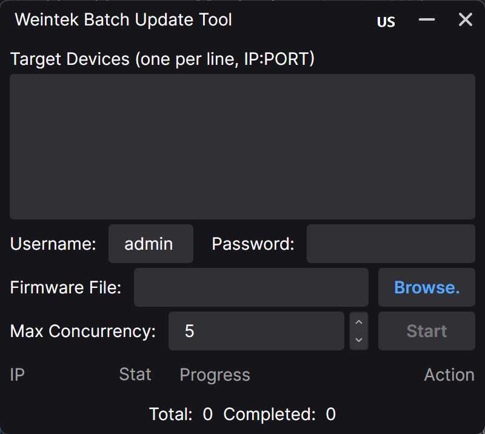
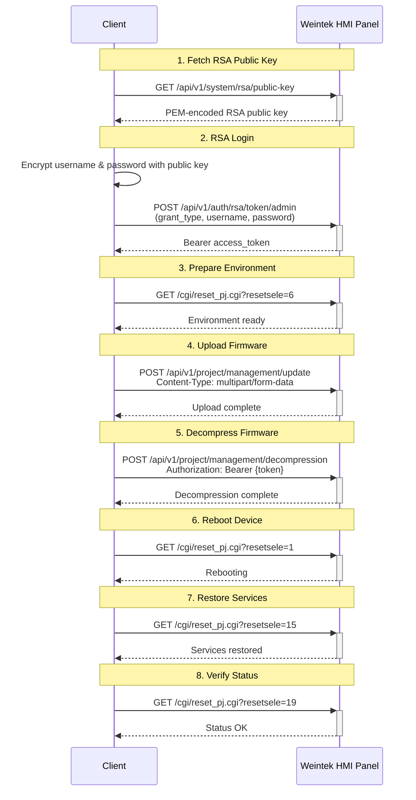

# WeinBatchUpdate — Weintek cMT X HMI Batch Firmware Upgrade Tool [中文](README_zh.md)


> **⚠️ Compatibility Notice**
>
> This tool is **only** compatible with Weintek cMT X series HMIs that support the EasyWeb function.

---

## Project Overview

WeinBatchUpdate is a Windows desktop application for performing **batch firmware upgrades on multiple Weintek cMT X series HMIs simultaneously over the network**.

Say goodbye to upgrading devices one by one through the web interface — simply paste a list of IP addresses, select a firmware file (`.exob`), and click Start. The tool handles authentication, upload, decompression, and reboot for all target devices with parallel processing.

Built with:
- [Avalonia UI 12](https://avaloniaui.net/) — cross-platform desktop UI framework
- [CommunityToolkit.Mvvm](https://github.com/CommunityToolkit/dotnet) — MVVM source generators
- [Semi.Avalonia](https://github.com/irihitech/Semi.Avalonia) — modern theme with built-in localization support

---

## Features

| Feature | Description |
|---------|-------------|
| 🔄 **Batch parallel update** | Configurable concurrency limit |
| 📊 **Real-time progress** | Per-device progress bar with percentage overlay and status text |
| 🌐 **Chinese / English** | Full UI localization via MarkupExtension; toggle with a flag button |
| 🔁 **Retry on failure** | Failed devices show a "Retry" button in the Action column for one-click re-run |
| 📝 **Running log** | Live output of success/failure status for every device |
| 🔒 **RSA encrypted login** | Credentials encrypted with the device's RSA public key before transmission |

---

## Screenshots

> 

---

## How It Works

The application communicates with each HMI device over HTTP via the device's built-in EasyWeb API. The upgrade pipeline consists of 8 sequential stages:

1. **Get public key** — retrieves the RSA public key from the HMI for credential encryption
2. **Login** — sends RSA-encrypted username/password to obtain a Bearer token
3. **Prepare environment** — resets the project environment on the device
4. **Upload firmware** — POSTs the `.exob` file as multipart form data
5. **Decompress firmware** — triggers server-side decompression of the uploaded file
6. **Restart device** — reboots the HMI to apply the new firmware
7. **Restore services** — restarts device services after reboot
8. **Check status** — final health check to confirm the update completed

---

## Usage

1. **Download** the latest release from the [Releases page](https://github.com/seishinkouki/WeinBatchUpdate/releases).
2. **Run** `WeinBatchUpdate.exe` (no installation required).
3. **Enter target devices** — paste IP addresses in the text area, one per line (supports commas and semicolons as delimiters):
   ```
   192.168.1.1:80
   192.168.1.2:80
   192.168.1.3:80
   ```
4. **Enter credentials** — the default username is `admin`.
5. **Select firmware file** — click **Browse** and choose a `.exob` firmware file.
6. **Set concurrency** — adjust the number of devices to update simultaneously (1–16).
7. **Start** — click the **Start** button to begin the batch update.
8. **Monitor progress** — watch the DataGrid for per-device status, progress bars, and logs.
9. **Retry if needed** — failed devices show a **Retry** button in the Action column.

### Language Switching

Click the flag button (🇨🇳 / 🇺🇸) in the title bar to toggle between Chinese and English.

---

## Update Flow Diagram



---

## API Reference

The HMI device exposes the following HTTP endpoints (all relative to the device IP):

| Method | Endpoint | Description |
|--------|----------|-------------|
| `GET` | `/api/v1/system/rsa/public-key` | Retrieve RSA public key for credential encryption |
| `POST` | `/api/v1/auth/rsa/token/admin` | Login with RSA-encrypted credentials (OAuth2 password grant) |
| `GET` | `/cgi/reset_pj.cgi?resetsele=6` | Reset the project environment |
| `POST` | `/api/v1/project/management/update` | Upload firmware file (multipart form-data) |
| `POST` | `/api/v1/project/management/decompression` | Decompress uploaded firmware |
| `GET` | `/cgi/reset_pj.cgi?resetsele=1` | Reboot the device |
| `GET` | `/cgi/reset_pj.cgi?resetsele=15` | Restart device services |
| `GET` | `/cgi/reset_pj.cgi?resetsele=19` | Perform a final health check |

All authenticated requests use the Bearer token obtained during login:

```
Authorization: Bearer eyJ...
```

---

## Build from Source

### Prerequisites

- [.NET 10.0 SDK](https://dotnet.microsoft.com/download/dotnet/10.0)

### Steps

```bash
# Clone the repository
git clone https://github.com/seishinkouki/WeinBatchUpdate.git
cd WeinBatchUpdate

# Restore dependencies and build
dotnet restore
dotnet build -c Release

# Run
dotnet run --project WeinBatchUpdate
```

The compiled output will be at:

```
WeinBatchUpdate/bin/Release/net10.0/WeinBatchUpdate.exe
```

### Project Structure

```
WeinBatchUpdate/
├── App.axaml                  # Application root (theme, locale)
├── App.axaml.cs               # App lifecycle, SemiTheme locale sync
├── Program.cs                 # Entry point
├── ViewLocator.cs             # ViewModel → View resolver
├── Assets/                    # Icons and static assets
├── Extensions/
│   └── LocExtension.cs        # MarkupExtension for live localization
├── Models/
│   └── DeviceUpdateStatus.cs  # Per-device state model
├── Services/
│   ├── HMIUpdater.cs           # Firmware-update pipeline
│   └── LocalizationService.cs # Singleton locale manager
├── ViewModels/
│   ├── ViewModelBase.cs       # MVVM base class
│   └── MainWindowViewModel.cs # Main ViewModel (app logic)
├── Views/
│   ├── MainWindow.axaml       # Main window layout
│   └── MainWindow.axaml.cs    # Main window code-behind
└── WeinBatchUpdate.csproj     # Project file
```

---

## Disclaimer

- This project is a third-party open-source tool and **is not affiliated with Weintek in any way**. It has not been officially authorized or endorsed by Weintek.
- "Weintek", "cMT", and related trademarks are the property of their respective owners.
- This project is intended for learning and research purposes only. Users assume all risks and should comply with Weintek's terms of use and applicable laws and regulations.
- The author is not responsible for any device damage, data loss, or other liabilities resulting from the use of this tool.

---

## License

MIT License

