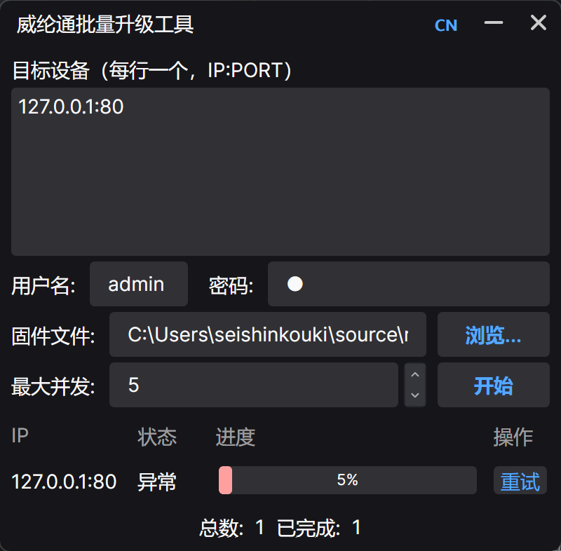
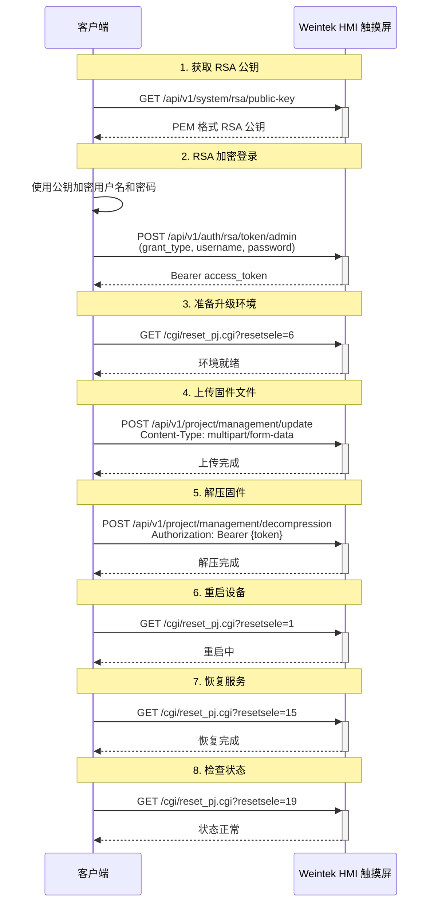

# WeinBatchUpdate — 威纶通 cMT X HMI 批量固件升级工具


> **⚠️ 兼容性提示**
>
> 本工具**仅**适用于支持 EasyWeb 功能的威纶通 cMT X 系列 HMI 设备。

---

## 项目简介

WeinBatchUpdate 是一款 Windows 桌面应用程序，用于**通过网络同时对多台威纶通 cMT X 系列 HMI 进行批量固件升级**。

告别逐台登录 Web 界面手动升级的繁琐操作——只需粘贴一批 IP 地址、选择固件文件（`.cxob`）、点击开始，工具即可自动完成所有目标设备的认证、上传、解压和重启操作，支持多设备并行处理。

技术栈：
- [Avalonia UI 12](https://avaloniaui.net/) — 跨平台桌面 UI 框架
- [CommunityToolkit.Mvvm](https://github.com/CommunityToolkit/dotnet) — MVVM 源代码生成器
- [Semi.Avalonia](https://github.com/irihitech/Semi.Avalonia) — 现代化主题，内置本地化支持

---

## 功能特性

| 功能 | 说明 |
|------|------|
| 🔄 **批量并行升级** | 可自定义并发数 |
| 📊 **实时进度显示** | 每台设备独立进度条 + 百分比文字 + 状态描述 |
| 🌐 **中英文切换** | 基于 MarkupExtension 的完整 UI 本地化，点击旗帜按钮切换 |
| 🔁 **失败重试** | 升级失败的设备在操作列显示"重试"按钮，一键重新升级 |
| 📝 **运行日志** | 实时输出每台设备的成功/失败日志 |
| 🔒 **RSA 加密登录** | 凭据使用设备公钥 RSA 加密后传输，保证安全 |

---

## 软件截图

> 

---

## 工作原理

应用程序通过 HMI 设备内置的 EasyWeb API 与每台设备进行 HTTP 通信。升级流程包括 8 个连续阶段：

1. **获取公钥** — 从 HMI 获取 RSA 公钥，用于凭据加密
2. **登录设备** — 发送 RSA 加密的用户名/密码，获取 Bearer Token
3. **准备环境** — 重置设备上的工程环境
4. **上传固件** — 以 multipart 表单形式 POST 上传 `.cxob` 固件文件
5. **解压固件** — 触发服务端对上传文件进行解压
6. **重启设备** — 重启 HMI 以应用新固件
7. **恢复服务** — 重启后恢复设备服务
8. **检查状态** — 最终健康检查，确认升级完成

---

## 使用说明

1. **下载** 最新版本，从 [Releases 页面](https://github.com/seishinkouki/WeinBatchUpdate/releases) 获取。
2. **运行** `WeinBatchUpdate.exe`（无需安装，绿色运行）。
3. **输入目标设备** — 在文本框中粘贴 IP 地址，每行一个（支持逗号、分号分隔）：
   ```
   192.168.1.1:80
   192.168.1.2:80
   192.168.1.3:80
   ```
4. **输入凭据** — 默认用户名为 `admin`。
5. **选择固件文件** — 点击 **浏览…** 选择 `.cxob` 固件文件。
6. **设置并发数** — 调整可同时升级的设备数量（1–16）。
7. **开始升级** — 点击 **开始** 按钮启动批量升级。
8. **监控进度** — 通过 DataGrid 表格查看每台设备的状态、进度条和日志。
9. **失败重试** — 升级失败的设备在操作列显示 **重试** 按钮，点击即可重试。

### 语言切换

点击标题栏中的国旗按钮（🇨🇳 / 🇺🇸）即可在中英文之间切换。

---

## 升级流程图



---

## API 参考

HMI 设备提供以下 HTTP 接口（均相对于设备 IP 地址）：

| 方法 | 端点 | 说明 |
|------|------|------|
| `GET` | `/api/v1/system/rsa/public-key` | 获取 RSA 公钥，用于凭据加密
| `POST` | `/api/v1/auth/rsa/token/admin` | 使用 RSA 加密凭据登录（OAuth2 password grant）
| `GET` | `/cgi/reset_pj.cgi?resetsele=6` | 重置工程环境
| `POST` | `/api/v1/project/management/update` | 上传固件文件（multipart form-data）
| `POST` | `/api/v1/project/management/decompression` | 解压已上传的固件
| `GET` | `/cgi/reset_pj.cgi?resetsele=1` | 重启设备
| `GET` | `/cgi/reset_pj.cgi?resetsele=15` | 恢复设备服务
| `GET` | `/cgi/reset_pj.cgi?resetsele=19` | 执行最终健康检查

已认证请求均使用登录时获取的 Bearer Token：

```
Authorization: Bearer eyJ...
```

---

## 从源码构建

### 前置条件

- [.NET 10.0 SDK](https://dotnet.microsoft.com/download/dotnet/10.0)

### 构建步骤

```bash
# 克隆仓库
git clone https://github.com/seishinkouki/WeinBatchUpdate.git
cd WeinBatchUpdate

# 还原依赖并编译
dotnet restore
dotnet build -c Release

# 运行
dotnet run --project WeinBatchUpdate
```

编译输出路径：

```
WeinBatchUpdate/bin/Release/net10.0/WeinBatchUpdate.exe
```

### 项目结构

```
WeinBatchUpdate/
├── App.axaml                  # 应用程序根节点（主题、区域设置）
├── App.axaml.cs               # 应用程序生命周期，SemiTheme 本地化同步
├── Program.cs                 # 入口文件
├── ViewLocator.cs             # ViewModel → View 解析器
├── Assets/                    # 图标及静态资源
├── Extensions/
│   └── LocExtension.cs        # 实时本地化 MarkupExtension
├── Models/
│   └── DeviceUpdateStatus.cs  # 单设备状态模型
├── Services/
│   ├── HMIUpdater.cs           # 固件升级管线
│   └── LocalizationService.cs # 单例本地化管理器
├── ViewModels/
│   ├── ViewModelBase.cs       # MVVM 基类
│   └── MainWindowViewModel.cs # 主 ViewModel（应用逻辑）
├── Views/
│   ├── MainWindow.axaml       # 主窗口布局
│   └── MainWindow.axaml.cs    # 主窗口后端代码
└── WeinBatchUpdate.csproj     # 项目文件
```

---

## 免责声明

- 本项目为第三方开源工具，**与威纶通 (Weintek) 公司无任何关联**，未获得其官方授权或认可。
- "Weintek"、"威纶通"、"cMT" 及相关商标均为其各自所有者的财产。
- 本项目仅供学习和研究用途，使用者应自行承担所有风险。请遵守威纶通产品的使用条款及相关法律法规。
- 作者不对因使用本工具导致的设备损坏、数据丢失或任何其他损失承担责任。

---

## 开源许可

MIT License
